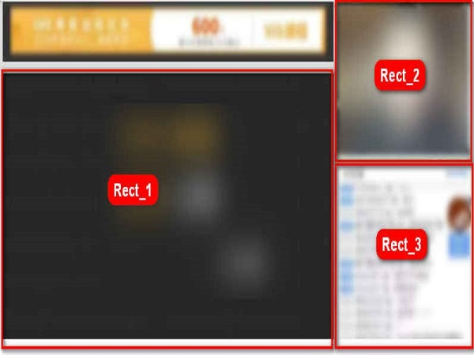
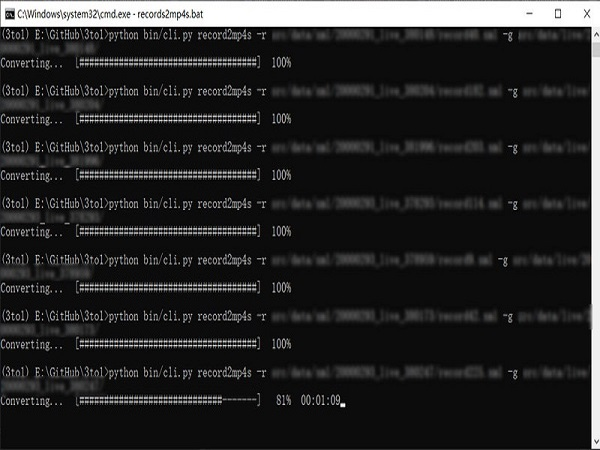
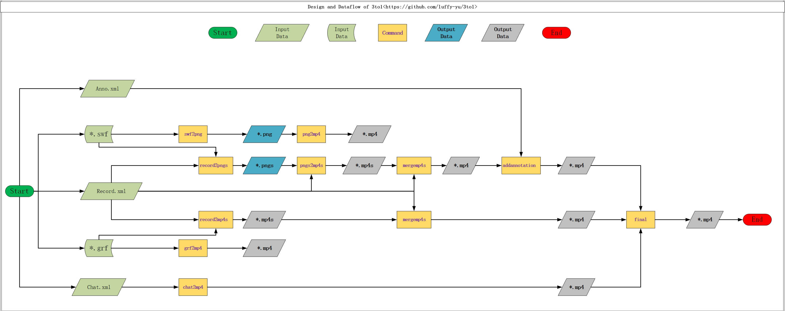

# 3to1

How to merge **3** kinds of sources (*.swf, *.grf, *.xml) to **1** video

# Python Version

- 3.6.9

## Supported and Tested Platforms

- macOS(**Original Development Environment**)

- Windows

## Preview

- original



- running




- processed


## Usage

- Help

```bash
python bin/cli.py
Usage: cli.py [OPTIONS] COMMAND [ARGS]...

Options:
  --help  Show this message and exit.

Commands:
  addannotation  Add annotation to mp4 file
  chat2mp4       Convert chat xml file to mp4 file
  final          3to1, merge 3 mp4 files to one mp4 file
  grf2mp4        Covert grf to mp4
  mergemp4s      Merge mp4 files to ONE mp4 file
  png2mp4        Convert png to mp4
  pngs2mp4s      Convert pngs to mp4s
  record2mp4s    Convert grfs in record.xml to mp4s
  record2pngs    Convert swfs in record.xml to pngs
  swf2png        Convert swf to png
```

- Demo

```bash
python bin/cli.py record2pngs -r src/data/xml/record.xml -s src/data/live/
python bin/cli.py pngs2mp4s -r src/data/xml/record.xml -p src/data/live/
python bin/cli.py record2mp4s -r src/data/xml/record.xml -g src/data/live/
python bin/cli.py chat2mp4 -c src/data/xml/chat.xml
python bin/cli.py mergemp4s -r src/data/xml/record.xml -m src/data/live/ -o src/data/live/swf.mp4 --source swf
python bin/cli.py mergemp4s -r src/data/xml/record.xml -m src/data/live/ -o src/data/live/grf.mp4 --source grf
python bin/cli.py addannotation -m src/data/live/swf.mp4 -a src/data/xml/anno.xml --resize
python bin/cli.py final -s src/data/live/swf_anno.mp4 -g src/data/live/grf.mp4 -c src/data/xml/chat.mp4 -o src/data/live/final.mp4
```


## Design




## Routine map

- swf2png

**selenium**

- grf2mp4

ffmpeg

- png2mp4

ffmpeg

- chat2mp4

moviepy

FFMPEG_VideoWriter

## Tips

- ffmpeg location on macOS

~/Library/Application Support/imageio/ffmpeg/ffmpeg-osx-v3.2.4

## Download URLs

### version 4.2.1

- macOS

`https://evermeet.cx/ffmpeg/`

- windows

`https://ffmpeg.zeranoe.com/builds/`

## QA

- Data

Sorry, I can not publicize it.

If needed, you can touch me by email, yuliuchuan@gmail.com.

